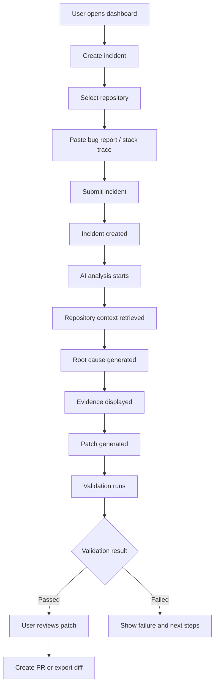
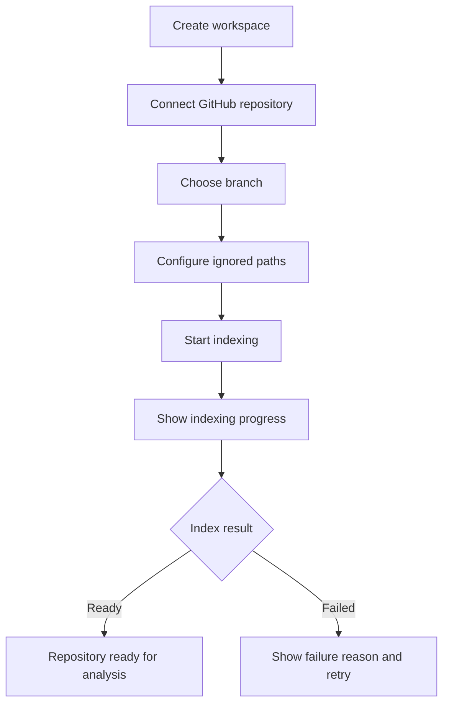
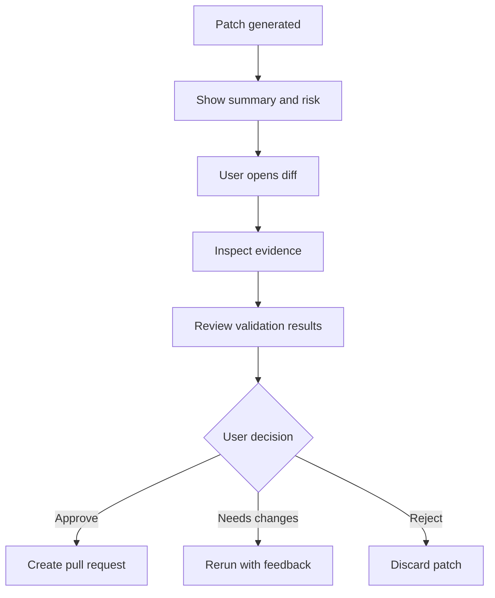
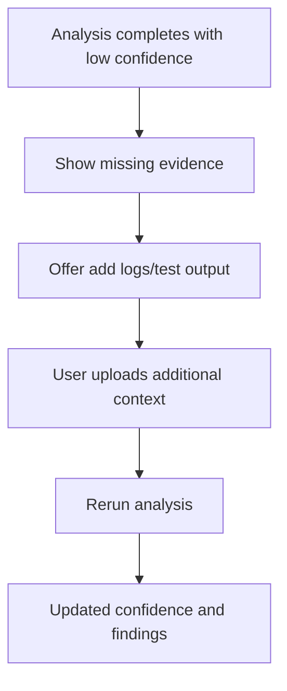

# design.md — Comprehensive UI/UX Design System for DevSentinel AI

> **Project:** DevSentinel AI  
> **Product Category:** AI-powered full-stack developer platform for codebase debugging, incident analysis, patch generation, and production engineering workflows.  
> **Purpose:** This file is the definitive visual and interaction design guide for building DevSentinel AI with a premium, production-grade, developer-tool user experience.

---

## Instructions for AI Design / Coding Assistant

- Read this ENTIRE document before generating any UI, frontend code, layout, component, animation, copy, or styling.
- Also read `info.md` and `instructions.md` before making implementation decisions.
- Do not create generic SaaS dashboards. DevSentinel AI must feel like a serious engineering command center.
- Follow the design system, spacing, typography, component rules, page specs, interaction patterns, and accessibility requirements exactly.
- Every screen must include loading, empty, error, partial success, unauthorized, and degraded AI states where relevant.
- Use precise developer-focused language. Avoid hype, vague AI claims, and decorative filler.
- Make UI decisions that increase trust, clarity, speed, and confidence.
- Never copy another product directly. Use inspiration from premium developer tools, but create an original identity.
- Generate production-ready components with responsive behavior, keyboard support, and accessibility built in.
- Default to dark-mode-first design, while supporting light mode cleanly.
- Prioritize dense but readable layouts suitable for engineers working with code, logs, incidents, and AI evidence.
- Treat AI output as untrusted until validated and displayed with evidence, confidence, and risk context.

---

# Table of Contents

1. [Design North Star](#1-design-north-star)
2. [Product Personality](#2-product-personality)
3. [Inspiration Map](#3-inspiration-map)
4. [Information Architecture](#4-information-architecture)
5. [Global Layout System](#5-global-layout-system)
6. [Visual Language](#6-visual-language)
7. [Design Tokens](#7-design-tokens)
8. [Typography System](#8-typography-system)
9. [Color System](#9-color-system)
10. [Spacing, Radius, Border, and Elevation](#10-spacing-radius-border-and-elevation)
11. [Iconography and Visual Signals](#11-iconography-and-visual-signals)
12. [Motion and Interaction](#12-motion-and-interaction)
13. [Core Components](#13-core-components)
14. [AI-Specific Components](#14-ai-specific-components)
15. [Code and Diff UI](#15-code-and-diff-ui)
16. [Data Visualization](#16-data-visualization)
17. [Page-by-Page UX Specifications](#17-page-by-page-ux-specifications)
18. [User Flows](#18-user-flows)
19. [Responsive Design](#19-responsive-design)
20. [Empty, Loading, Error, and Partial States](#20-empty-loading-error-and-partial-states)
21. [Accessibility Requirements](#21-accessibility-requirements)
22. [Copywriting and Microcopy](#22-copywriting-and-microcopy)
23. [Frontend Implementation Guidance](#23-frontend-implementation-guidance)
24. [Design QA Checklist](#24-design-qa-checklist)
25. [Future Design Roadmap](#25-future-design-roadmap)

---

# 1. Design North Star

## 1.1 One-Sentence Design Goal

DevSentinel AI should feel like a **premium AI engineering command center** where developers can confidently investigate incidents, inspect evidence, review generated patches, and understand system behavior without losing control.

## 1.2 Core Experience Promise

The UI must communicate:

> “The AI is powerful, but the engineer remains in control.”

DevSentinel should never feel like an opaque magic box. Every recommendation must be shown with:

- Evidence
- Confidence
- Risk level
- Files affected
- Tests or validation status
- Next best action
- Human review boundary

## 1.3 Design Principles

| Principle | Meaning | UI Implication |
|---|---|---|
| Trust through evidence | AI claims must be inspectable | Always show citations, files, logs, and reasoning context |
| Calm under pressure | Incident response is stressful | Use restrained colors, clear hierarchy, and stable layouts |
| Dense but legible | Developers need lots of information | Compact layouts, structured panels, strong alignment |
| Human in control | AI suggests; users approve | Confirmation states before applying patches or creating PRs |
| Progressive disclosure | Do not overwhelm first view | Summary first, raw details one click away |
| Fast perceived performance | Long AI jobs must feel alive | Streaming progress, step timeline, skeletons |
| Production realism | Must not look like a demo | Complete states, polished details, robust edge cases |
| Original but familiar | Use known developer patterns | Code diffs, issue timelines, sidebars, command menus |

## 1.4 Emotional Target

The product should make users feel:

- “I understand what is happening.”
- “I can trust this recommendation enough to review it.”
- “The system is saving me investigation time.”
- “The AI is not hiding uncertainty.”
- “This looks like something a real engineering team would use.”

Avoid making users feel:

- “This is just a chatbot.”
- “I don’t know where the AI got this answer.”
- “The interface is decorative but shallow.”
- “The tool might modify my code without permission.”
- “This was generated from a generic dashboard template.”

---

# 2. Product Personality

## 2.1 Brand Character

DevSentinel AI is:

- Technical
- Calm
- Precise
- Security-aware
- Evidence-driven
- Fast
- Minimal but rich
- Senior-engineer-like

DevSentinel AI is not:

- Playful
- Loud
- Overly futuristic
- Corporate generic
- Cartoonish
- Marketing-heavy inside the app
- Overanimated
- AI-hype driven

## 2.2 Design Keywords

Use these words as design filters:

```text
command center
incident cockpit
code intelligence
evidence trail
controlled automation
developer trust
quiet precision
production diagnostics
```

## 2.3 Visual Metaphor

The visual metaphor is:

> A mission-control interface for debugging software systems.

This means:

- Central workspace
- Left navigation
- Right contextual inspector
- Timeline of events
- Status indicators
- Evidence links
- Code panels
- Logs and metrics
- Controlled action areas

## 2.4 Design Anti-Patterns

Avoid:

- Big colorful gradient backgrounds inside the app
- Overly large cards that waste space
- Chatbot-first interface as the whole product
- Cute robot mascots
- Excessive emoji
- Generic “AI generated this” badges everywhere
- Popups interrupting core workflows
- Low-information landing page mockups
- Unexplained confidence scores
- Hidden or vague error messages

---

# 3. Inspiration Map

DevSentinel AI should draw inspiration from premium developer tools without copying them.

## 3.1 Inspiration Sources by Product Area

| Product Area | Inspiration Direction | What to Borrow Conceptually |
|---|---|---|
| Dashboard structure | Linear | Sidebar, compact panels, fast keyboard-first feeling |
| AI agent workflow | Cursor | Agent progress, file-aware AI, codebase context, task execution |
| Incident detail | Sentry | Issue details, event timeline, stack trace context, tags |
| Patch review | GitHub PRs | Diff review, file list, review status, human approval |
| Observability | Datadog | Metrics panels, traces, log correlation, operational density |
| Product analytics | PostHog | Event feed, feature flags, workspace analytics |
| Landing page | Resend / Vercel | Developer-first hero, clean product preview, code snippets |
| Settings and deployment | Vercel | Project cards, environment/settings polish, team controls |

## 3.2 Original Identity Rule

Do not visually clone any source. Use this synthesis:

```text
Linear-like structure
+ Cursor-like AI workflow
+ Sentry-like incident evidence
+ GitHub-like patch review
+ Datadog-like operational telemetry
= DevSentinel AI
```

## 3.3 Visual Differentiation

DevSentinel should differentiate with:

- Evidence-first AI cards
- Agent timeline with visible validation checkpoints
- Confidence and risk shown together
- Split incident workspace: evidence / reasoning / patch
- Code-aware citation chips
- Safety gates before AI actions
- Unified command center layout for repo + incident + AI workflow

---

# 4. Information Architecture

## 4.1 Primary Navigation

Main app navigation:

```text
Dashboard
Repositories
Incidents
Analysis Runs
Patches
Observability
Activity
Settings
```

Optional advanced navigation:

```text
Integrations
API Keys
Team
Billing
Audit Logs
Feature Flags
```

## 4.2 Navigation Hierarchy

```text
App Shell
├── Dashboard
│   ├── Overview
│   ├── Recent incidents
│   ├── Analysis health
│   └── Repository status
├── Repositories
│   ├── Repository list
│   ├── Repository detail
│   ├── Indexing status
│   ├── Files
│   └── Settings
├── Incidents
│   ├── Incident list
│   ├── Incident detail
│   ├── Evidence
│   ├── AI analysis
│   ├── Patch review
│   └── Timeline
├── Analysis Runs
│   ├── Run history
│   ├── Run detail
│   ├── Agent steps
│   └── Model/prompt metadata
├── Patches
│   ├── Candidate patches
│   ├── Review queue
│   ├── Validation results
│   └── PR creation
├── Observability
│   ├── AI workflow metrics
│   ├── Worker health
│   ├── Logs
│   ├── Traces
│   └── Cost and latency
└── Settings
    ├── Workspace
    ├── Members
    ├── Integrations
    ├── Security
    ├── API Keys
    └── Audit Logs
```

## 4.3 Core Objects

| Object | Description | Main Screen |
|---|---|---|
| Workspace | Organization/team container | Settings |
| Repository | Connected codebase | Repository detail |
| Repository Index | Searchable code intelligence layer | Repository indexing page |
| Incident | User-reported bug/failure | Incident detail |
| Analysis Run | AI investigation workflow | Analysis run detail |
| Evidence | File/log/test snippet supporting AI claims | Evidence panel |
| Finding | Root-cause or risk conclusion | AI analysis panel |
| Patch | Candidate code change | Patch review |
| Sandbox Run | Test execution result | Validation panel |
| Audit Event | Security-sensitive activity | Audit log |

## 4.4 Global Search / Command Menu

The app should support a command menu.

Trigger:

```text
Cmd/Ctrl + K
```

Command menu should search:

- Repositories
- Incidents
- Analysis runs
- Files
- Settings
- Actions

Example commands:

```text
Create incident
Connect repository
Search codebase
Open recent analysis
View failed patches
Go to audit logs
Toggle theme
```

Design behavior:

- Opens centered modal.
- Keyboard-first.
- Shows recent items before typing.
- Groups results by type.
- Supports direct actions and navigation.

---

# 5. Global Layout System

## 5.1 App Shell

Default desktop shell:

```text
┌───────────────────────────────────────────────────────────────┐
│ Top Bar: workspace, search, status, user menu                 │
├──────────────┬────────────────────────────────────────────────┤
│ Sidebar      │ Main Content                                   │
│ Navigation   │                                                │
│              │ Page header                                    │
│              │ Primary workspace                              │
│              │                                                │
└──────────────┴────────────────────────────────────────────────┘
```

For complex pages, use three-column layout:

```text
┌──────────────┬──────────────────────────────┬─────────────────┐
│ Sidebar      │ Main investigation workspace │ Context panel   │
│              │                              │ Evidence/meta   │
└──────────────┴──────────────────────────────┴─────────────────┘
```

## 5.2 Layout Dimensions

| Region | Desktop Size |
|---|---:|
| Sidebar width | 248px |
| Collapsed sidebar | 64px |
| Top bar height | 56px |
| Page horizontal padding | 24px |
| Main content max width | 1440px |
| Right inspector width | 360–420px |
| Modal max width | 520–960px depending on purpose |

## 5.3 Sidebar Design

Sidebar must include:

- Product mark
- Workspace switcher
- Primary navigation
- Secondary navigation
- Usage/status footer
- Collapse control

Sidebar style:

- Slightly darker/lighter than content background
- Border-right
- Compact nav rows
- Active item uses subtle filled background and left accent
- Icons are consistent stroke width

Example structure:

```text
DevSentinel AI
Workspace: Acme Engineering

Overview
Repositories
Incidents
Analysis Runs
Patches
Observability

Settings
Audit Logs

AI usage: 68%
```

## 5.4 Top Bar

Top bar contains:

- Breadcrumb
- Global search
- Environment selector if relevant
- Background job indicator
- Notification/inbox
- User menu

Top bar should feel utilitarian, not decorative.

## 5.5 Page Header Pattern

Every major page uses:

```text
Title
Short description or metadata
Primary action
Secondary actions
Optional status chips
```

Example:

```text
Incident: API login failures after deployment
Repository: api-platform · Severity: High · Status: Analysis running
[Generate patch] [Open evidence] [More]
```

## 5.6 Right Inspector Pattern

Use right inspector for:

- Evidence
- Metadata
- Risk
- Related files
- Activity
- Suggested next actions
- Prompt/model details

Right inspector must be collapsible on smaller screens.

---

# 6. Visual Language

## 6.1 Overall Look

The visual style should be:

```text
dark-mode-first
low contrast background layers
sharp typography
subtle borders
small glows only for active AI states
compact developer-tool density
high-quality spacing
minimal color accents
```

## 6.2 Surface Model

Use layered surfaces:

| Layer | Usage |
|---|---|
| Background | Full app canvas |
| Sidebar | Navigation surface |
| Panel | Main content cards |
| Raised panel | Active/selected/important sections |
| Overlay | Modals, popovers, command menu |
| Code surface | Code, logs, diffs |

## 6.3 Border Language

Borders should define structure more than shadows.

Use:

- 1px borders
- Subtle contrast
- Slightly stronger border for active panels
- Accent border for selected AI step or risk area

Avoid heavy drop shadows in dense app views.

## 6.4 Premium Detail Rules

Small details that make UI feel human-crafted:

- Align metadata labels precisely.
- Use consistent chip heights.
- Use real timestamps and relative time.
- Use differentiated file icons.
- Use tabular numbers for metrics.
- Use compact but readable line heights.
- Use empty states tailored to the exact context.
- Show useful skeleton shapes, not generic blocks.
- Use subtle separators rather than random spacing.
- Make destructive actions visually and textually careful.

---

# 7. Design Tokens

## 7.1 Token Philosophy

All design should be token-driven.

Never scatter arbitrary colors, radii, shadows, or spacing values across components.

## 7.2 Semantic Token Names

Use semantic names, not raw color names.

Good:

```text
background
surface
surface-raised
border-subtle
text-primary
text-muted
status-success
risk-high
ai-active
```

Bad:

```text
gray900
blue500
cardBg2
randomBorder
```

## 7.3 CSS Variable Foundation

Recommended token structure:

```css
:root {
  --background: 0 0% 100%;
  --foreground: 222 47% 11%;

  --surface: 210 40% 98%;
  --surface-raised: 0 0% 100%;
  --surface-code: 220 20% 97%;

  --border-subtle: 214 32% 91%;
  --border-strong: 215 20% 75%;

  --text-primary: 222 47% 11%;
  --text-secondary: 215 16% 35%;
  --text-muted: 215 14% 48%;
  --text-disabled: 215 12% 62%;

  --accent: 252 83% 58%;
  --accent-muted: 252 70% 96%;

  --success: 152 69% 38%;
  --warning: 38 92% 50%;
  --danger: 0 72% 51%;
  --info: 217 91% 60%;

  --risk-low: 152 69% 38%;
  --risk-medium: 38 92% 50%;
  --risk-high: 0 72% 51%;
  --risk-unknown: 215 14% 48%;

  --radius-sm: 0.375rem;
  --radius-md: 0.625rem;
  --radius-lg: 0.875rem;
  --radius-xl: 1rem;
  --radius-2xl: 1.25rem;
}

.dark {
  --background: 222 47% 4%;
  --foreground: 210 40% 98%;

  --surface: 222 36% 6%;
  --surface-raised: 222 32% 8%;
  --surface-code: 225 38% 5%;

  --border-subtle: 220 25% 14%;
  --border-strong: 220 20% 22%;

  --text-primary: 210 40% 98%;
  --text-secondary: 214 20% 78%;
  --text-muted: 215 14% 60%;
  --text-disabled: 215 10% 45%;

  --accent: 252 83% 66%;
  --accent-muted: 252 30% 16%;

  --success: 151 65% 45%;
  --warning: 38 92% 56%;
  --danger: 0 72% 60%;
  --info: 217 91% 65%;
}
```

## 7.4 Tailwind Mapping

Tailwind theme should map to semantic tokens:

```ts
colors: {
  background: "hsl(var(--background))",
  foreground: "hsl(var(--foreground))",
  surface: {
    DEFAULT: "hsl(var(--surface))",
    raised: "hsl(var(--surface-raised))",
    code: "hsl(var(--surface-code))",
  },
  border: {
    subtle: "hsl(var(--border-subtle))",
    strong: "hsl(var(--border-strong))",
  },
  text: {
    primary: "hsl(var(--text-primary))",
    secondary: "hsl(var(--text-secondary))",
    muted: "hsl(var(--text-muted))",
    disabled: "hsl(var(--text-disabled))",
  },
  status: {
    success: "hsl(var(--success))",
    warning: "hsl(var(--warning))",
    danger: "hsl(var(--danger))",
    info: "hsl(var(--info))",
  },
  risk: {
    low: "hsl(var(--risk-low))",
    medium: "hsl(var(--risk-medium))",
    high: "hsl(var(--risk-high))",
    unknown: "hsl(var(--risk-unknown))",
  }
}
```

---

# 8. Typography System

## 8.1 Font Direction

Use a modern, highly legible sans-serif for UI and a dedicated monospace for code.

Recommended:

| Usage | Font |
|---|---|
| UI | Inter, Geist Sans, or system sans |
| Code/logs | JetBrains Mono, Geist Mono, or SF Mono |

Use system fallback safely.

```css
--font-sans: Inter, Geist, ui-sans-serif, system-ui, -apple-system, BlinkMacSystemFont, "Segoe UI", sans-serif;
--font-mono: "JetBrains Mono", "Geist Mono", "SF Mono", Consolas, monospace;
```

## 8.2 Type Scale

| Token | Size | Line Height | Usage |
|---|---:|---:|---|
| `display` | 48px | 56px | Landing hero only |
| `h1` | 28px | 36px | App page title |
| `h2` | 22px | 30px | Major section |
| `h3` | 18px | 26px | Card title |
| `body` | 14px | 22px | Default UI text |
| `body-sm` | 13px | 20px | Dense dashboard text |
| `caption` | 12px | 18px | Metadata |
| `micro` | 11px | 16px | Chips, labels |
| `code` | 13px | 21px | Code blocks |
| `code-sm` | 12px | 19px | Dense diffs/logs |

## 8.3 Typography Usage

### Page title

```tsx
<h1 className="text-[28px] font-semibold leading-9 tracking-[-0.02em] text-text-primary">
  Incidents
</h1>
```

### Section title

```tsx
<h2 className="text-lg font-semibold tracking-[-0.01em] text-text-primary">
  Active analysis
</h2>
```

### Metadata label

```tsx
<span className="text-[11px] font-medium uppercase tracking-[0.08em] text-text-muted">
  Repository
</span>
```

### Code

```tsx
<code className="font-mono text-[13px] leading-[21px]">
  require_current_user()
</code>
```

## 8.4 Text Alignment Rules

- Left-align almost everything.
- Right-align numeric metric values only where useful.
- Avoid centered text inside app screens except empty states and modals.
- Landing pages may use centered hero sections.

---

# 9. Color System

## 9.1 Dark Mode First

Dark mode is the primary design target because:

- Developer tools often run in dark environments.
- Code/log views feel natural.
- Incident command-center metaphor works better.
- AI workflow visualization can be subtle and premium.

Light mode must still be polished and accessible.

## 9.2 Core Palette Intent

| Color Role | Purpose |
|---|---|
| Background | Deep neutral app canvas |
| Surface | Panels/cards |
| Surface Raised | Active or elevated areas |
| Code Surface | Code, logs, diffs |
| Accent | Primary actions and selected state |
| Success | Passing checks/completed states |
| Warning | Risk, missing validation, partial confidence |
| Danger | Failed checks/security/destructive actions |
| Info | In-progress AI/neutral guidance |

## 9.3 Risk Colors

Risk colors must be consistent across product.

| Risk | Visual Treatment |
|---|---|
| Low | Green chip, check icon, calm copy |
| Medium | Amber chip, alert icon, review copy |
| High | Red chip, shield/alert icon, explicit warning |
| Unknown | Gray chip, question icon, missing evidence copy |

## 9.4 Confidence Colors

Confidence should be shown with both text and visual scale.

| Confidence | Label | Visual |
|---:|---|---|
| 0–39 | Low | muted/danger-adjacent |
| 40–69 | Medium | warning |
| 70–89 | High | success/info |
| 90–100 | Very high | success |

Never show confidence as only a number without explanation.

## 9.5 Color Application Rules

Use color sparingly.

Good:

- Status chips
- Primary action
- Selected nav item
- Active AI step
- Risk warnings
- Test pass/fail
- Diff additions/deletions

Avoid:

- Random colorful cards
- Multiple accent colors competing
- Large saturated surfaces
- Gradients inside functional dashboard panels

---

# 10. Spacing, Radius, Border, and Elevation

## 10.1 Spacing Scale

Use Tailwind spacing consistently.

| Use | Value |
|---|---|
| Icon/text gap | `gap-1.5` or `gap-2` |
| Inline metadata gap | `gap-2` |
| Dense row padding | `px-3 py-2` |
| Card padding compact | `p-4` |
| Card padding standard | `p-5` |
| Page padding | `p-6` |
| Major section gap | `gap-6` |
| Large landing section | `py-20` or `py-24` |

## 10.2 Radius Scale

| Component | Radius |
|---|---|
| Small chips | `rounded-md` |
| Buttons | `rounded-lg` |
| Inputs | `rounded-lg` |
| Cards | `rounded-xl` |
| Large panels | `rounded-2xl` |
| Modals | `rounded-2xl` |
| Code blocks | `rounded-xl` |

Avoid fully rounded pills except for small status chips.

## 10.3 Border Usage

Use border for structure.

| Component | Border |
|---|---|
| Sidebar | right border |
| Top bar | bottom border |
| Card | subtle border |
| Active card | stronger border or accent ring |
| Modal | subtle border + shadow |
| Code panel | border + code surface |
| Diff line | border-separated rows where needed |

## 10.4 Shadow Usage

Dark app:

- Minimal shadows.
- Use border and surface contrast instead.

Light app:

- Use subtle shadows for overlays and raised panels.

Recommended shadow:

```css
--shadow-panel: 0 16px 40px rgba(0, 0, 0, 0.18);
--shadow-overlay: 0 24px 80px rgba(0, 0, 0, 0.32);
```

---

# 11. Iconography and Visual Signals

## 11.1 Icon Style

Use simple outline icons with consistent stroke width.

Recommended icon family:

```text
lucide-react
```

## 11.2 Icon Size

| Use | Size |
|---|---:|
| Sidebar nav | 16px |
| Button icon | 16px |
| Status chip | 12–14px |
| Empty state | 28–40px |
| Landing feature | 20–24px |
| Alert panel | 16–18px |

## 11.3 Icon Meaning

| Concept | Icon Direction |
|---|---|
| Incident | alert triangle / bug |
| Repository | git branch / folder git |
| Analysis | activity / sparkles used sparingly |
| Evidence | file search / quote |
| Patch | diff / git pull request |
| Risk | shield alert |
| Success | check circle |
| Failed | x circle |
| Running | loader / activity |
| Locked/security | lock / shield |
| Audit | list checks |
| Observability | pulse / chart |

## 11.4 Icon Rules

- Do not place icons in every card title by default.
- Use icons to clarify status or action.
- Pair icons with text for important states.
- Use `aria-hidden` for decorative icons.
- Provide accessible labels when icon-only buttons are used.

---

# 12. Motion and Interaction

## 12.1 Motion Philosophy

Motion should help users understand system state.

Use motion for:

- New streamed analysis steps
- Panel expansion
- Modal transitions
- Loading skeletons
- Progress indicators
- Toasts
- Command menu
- State transitions

Do not use motion for:

- Decoration unrelated to state
- Distracting background animations in app
- Excessive hover effects
- Long intro animations

## 12.2 Timing

| Interaction | Duration |
|---|---:|
| Button hover | 100ms |
| Menu open | 120–160ms |
| Panel expand | 180–220ms |
| Modal open | 180–240ms |
| Toast enter | 180ms |
| AI step highlight | 200–300ms |
| Skeleton shimmer | 1.2–1.6s |

## 12.3 Easing

Use restrained easing:

```css
--ease-standard: cubic-bezier(0.2, 0, 0, 1);
--ease-emphasized: cubic-bezier(0.16, 1, 0.3, 1);
```

## 12.4 AI Progress Animation

AI progress should feel alive but stable.

Use:

- Current step pulse
- Progress ring or linear progress
- Step-by-step timeline
- Subtle streaming indicator
- No fake terminal spam

Example steps:

```text
Queued
Reading incident context
Retrieving related files
Analyzing stack trace
Generating hypotheses
Building candidate patch
Running validation
Preparing summary
Completed
```

## 12.5 Reduced Motion

Respect `prefers-reduced-motion`.

- Disable non-essential animation.
- Replace animated progress with static state changes.
- Avoid shimmer if user prefers reduced motion.
- Keep status updates accessible.

---

# 13. Core Components

## 13.1 Button

### Variants

| Variant | Use |
|---|---|
| Primary | Main action |
| Secondary | Alternative action |
| Ghost | Low-emphasis action |
| Destructive | Delete/revoke/apply dangerous action |
| Outline | Secondary structured action |
| Link | Inline navigation |
| Icon | Compact toolbar action |

### States

- Default
- Hover
- Active
- Focus visible
- Disabled
- Loading
- Success confirmation where relevant

### Button copy

Use verb phrases:

```text
Analyze incident
Generate patch
Validate patch
Create pull request
Connect repository
Retry indexing
Open evidence
```

## 13.2 Input

Inputs must include:

- Label
- Placeholder only as example, not label replacement
- Help text when needed
- Error text
- Disabled state
- Required state
- Character count for constrained fields

## 13.3 Select / Combobox

Use for:

- Repository selection
- Severity selection
- Environment selection
- Model/provider selection
- Status filters

Must support:

- Search where options exceed 8
- Keyboard navigation
- Clear selected state
- Loading state for async options

## 13.4 Badge / Chip

Badge types:

| Type | Example |
|---|---|
| Status | Running, Failed, Completed |
| Severity | Low, Medium, High, Critical |
| Risk | Low risk, Medium risk, High risk |
| Confidence | High confidence |
| File type | Python, TypeScript |
| Source | Stack trace, Log, Test |

Badge design:

- Height: 22–26px
- Font: 11–12px
- Icon optional
- Subtle background
- Strong enough contrast

## 13.5 Card / Panel

Cards should have:

- Header
- Optional description
- Content area
- Optional footer/action row

Card density types:

| Density | Padding | Use |
|---|---|---|
| Compact | `p-3` | Metrics, list rows |
| Standard | `p-5` | Main panels |
| Spacious | `p-6` | Landing/onboarding |

## 13.6 Tabs

Use tabs for:

- Incident sections
- Repository detail
- Patch review views
- Observability views

Example incident tabs:

```text
Summary
Evidence
Patch
Timeline
Validation
Activity
```

Tabs must:

- Support keyboard navigation
- Show active state clearly
- Avoid hiding critical errors

## 13.7 Dialog / Modal

Use dialogs for:

- Confirm patch application
- Create incident
- Connect repository
- Invite member
- Revoke token
- Show raw prompt metadata

Dialog rules:

- Clear title
- Short explanation
- Primary and secondary actions
- Destructive confirmation copy where needed
- Focus trap
- Escape close unless dangerous mid-process

## 13.8 Toast

Use for non-blocking feedback.

Toast types:

- Success
- Info
- Warning
- Error

Include action only when useful:

```text
Patch exported
Candidate patch copied to clipboard.
[Open patch]
```

## 13.9 Table

Tables must support:

- Sorting where useful
- Filtering where useful
- Empty state
- Loading skeleton
- Row actions
- Responsive fallback
- Accessible headers

## 13.10 Timeline

Timeline is central to DevSentinel.

Use for:

- Incident activity
- AI analysis steps
- Sandbox run commands
- Audit events
- Repository indexing stages

Timeline row includes:

- Icon/status
- Title
- Timestamp/duration
- Details
- Expandable raw data where relevant

---

# 14. AI-Specific Components

## 14.1 AI Analysis Panel

Purpose:

Show root-cause summary, confidence, evidence, assumptions, and next action.

Structure:

```text
AI Analysis
├── Status header
├── Summary
├── Confidence + risk
├── Key evidence
├── Findings
├── Missing evidence
├── Suggested next step
└── Expand: reasoning details
```

Required states:

- Waiting for input
- Queued
- Running
- Partial
- Completed
- Failed
- Timed out
- Low-confidence

## 14.2 Agent Step Timeline

Each step row:

```text
[status icon] Step name
            Description
            Duration · Model/tool used
            Evidence count / output summary
```

Statuses:

- Pending
- Running
- Completed
- Failed
- Skipped
- Retrying
- Blocked

## 14.3 Evidence Citation Card

Evidence card fields:

- Source type
- File path or log source
- Line numbers if available
- Snippet
- Why it matters
- Linked finding
- Confidence contribution

Example:

```text
auth/session.py:84–103
`refresh_session()` returns None when the refresh token is expired.

Why this matters:
The failing stack trace enters `require_current_user()` without checking for a null session.
```

## 14.4 Confidence Meter

Must include:

- Numeric value
- Text label
- Explanation
- Evidence count
- Missing evidence warning if relevant

Example:

```text
Confidence: 78 · High
Supported by stack trace match, related middleware code, and failing test output.
```

## 14.5 Risk Assessment Card

Risk card fields:

- Risk level
- Affected files
- Sensitive areas touched
- Test status
- Blast radius
- Review recommendation

Example risk labels:

```text
Low risk
Medium risk
High risk
Unknown risk
```

## 14.6 AI Safety Gate

Use before irreversible or sensitive actions.

Examples:

- Create PR
- Apply patch
- Run expensive sandbox
- Send logs to AI
- Re-index large repository

Safety gate includes:

- Action summary
- What will happen
- What will not happen
- Risk level
- Required confirmation
- Cancel option

## 14.7 Prompt Metadata Drawer

Advanced users may inspect:

- Model
- Prompt version
- Retrieval strategy
- Context chunks
- Token usage
- Latency
- Parser version

Do not show raw prompts by default unless safe and useful.

## 14.8 Low-Confidence State

Design must not hide uncertainty.

Low-confidence panel:

```text
Evidence is limited

DevSentinel found a plausible cause, but confidence is low because the available repository context does not include the failing test or deployment logs.

Add more context:
[Upload logs] [Attach test output] [Search related files]
```

---

# 15. Code and Diff UI

## 15.1 Code Viewer

Code viewer must support:

- File path header
- Language label
- Copy button
- Line numbers
- Highlighted lines
- Evidence anchors
- Search within file where feasible
- Sticky header for long files

## 15.2 Diff Viewer

Diff viewer is critical.

Must show:

- File list
- Added/removed line counts
- Inline or split diff mode
- Syntax highlighting
- Comments/review notes optional
- Risk markers
- Test coverage markers where relevant

Header example:

```text
Candidate patch
3 files changed · +42 −18 · Medium risk · Validation pending
```

## 15.3 Diff Colors

Use conventional colors but subtle:

| Change | Treatment |
|---|---|
| Addition | Green-tinted background |
| Deletion | Red-tinted background |
| Context | Neutral code surface |
| Highlight | Accent border or subtle background |
| Warning line | Amber marker |

Do not make diff colors overly saturated.

## 15.4 Code Citation Links

Citation chip format:

```text
auth/session.py:84–103
```

Click behavior:

- Opens evidence/code panel.
- Scrolls to line.
- Highlights range.
- Updates URL hash if appropriate.

## 15.5 Logs UI

Logs must support:

- Timestamp
- Level
- Message
- Source
- Request ID
- Expandable metadata
- Search/filter
- Copy line
- Wrap toggle

Log levels:

| Level | Visual |
|---|---|
| debug | muted |
| info | neutral |
| warning | amber |
| error | red |
| critical | red + stronger emphasis |

---

# 16. Data Visualization

## 16.1 Chart Philosophy

Charts must answer operational questions, not decorate pages.

Good chart questions:

- Are AI workflows succeeding?
- Are analyses getting slower?
- Which repositories fail indexing?
- What is token/cost usage?
- Which incident severities dominate?
- Which validation steps fail most often?

## 16.2 Chart Types

| Use | Chart |
|---|---|
| Analysis success over time | Line chart |
| Latency distribution | Histogram |
| Cost/token trend | Line/area chart |
| Incident severity count | Bar chart |
| Step failure breakdown | Stacked bar |
| Current worker health | Metric cards |
| Repository indexing status | Progress/list hybrid |

## 16.3 Metric Card

Metric card structure:

```text
Label
Value
Delta
Small context
Optional sparkline
```

Example:

```text
Analysis success rate
94.2%
+3.1% from last week
```

## 16.4 Chart Rules

- Use clear axis labels.
- Avoid 3D charts.
- Avoid rainbow palettes.
- Use semantic colors.
- Include empty state.
- Include loading state.
- Include tooltip with exact values.
- Use tabular numbers for metrics.

---

# 17. Page-by-Page UX Specifications

## 17.1 Landing Page

### Goal

Convince recruiters/interviewers/users that DevSentinel is a polished AI developer platform, not a simple chatbot.

### Structure

```text
Hero
Product preview
Problem section
How it works
Feature grid
Architecture/AI workflow
Security/trust section
Developer experience section
Final CTA
```

### Hero copy direction

```text
AI incident analysis for production codebases

Connect a repository, attach logs, and let DevSentinel trace failures to evidence-backed root causes, candidate patches, and validation results.
```

### Hero visual

Show a realistic product preview:

- Left: incident list
- Center: AI analysis timeline
- Right: evidence and risk card
- Bottom: code diff preview

### Landing page tone

- Developer-first
- Technical
- Specific
- No exaggerated AI claims

### Primary CTA

```text
Analyze an incident
```

### Secondary CTA

```text
View demo workflow
```

## 17.2 Authentication Pages

### Sign in

Must be minimal and secure-feeling.

Elements:

- Product mark
- Email/password or OAuth buttons
- Security note
- Error state
- Loading state
- Link to create account

Copy:

```text
Sign in to DevSentinel
Access your repositories, incidents, and AI analysis workflows.
```

## 17.3 Onboarding Flow

### Steps

```text
1. Create workspace
2. Connect repository
3. Configure indexing exclusions
4. Run first index
5. Create sample incident or upload logs
```

### Design

Use stepper layout:

```text
Left: Step list
Center: Current step form
Right: Why this matters / security note
```

### Security copy

```text
DevSentinel excludes common secret files from indexing and redacts detected credentials before AI analysis.
```

## 17.4 Dashboard Overview

### Purpose

Give users a quick operational view.

### Sections

```text
Top metrics
Recent incidents
Repository health
Active AI runs
Patch review queue
System/worker health
```

### Layout

```text
Metric cards row
Two-column main grid
Right activity rail
```

### Metric cards

- Open incidents
- Active analyses
- Patch validation rate
- Repository index health
- Average analysis latency

## 17.5 Repository List Page

### Purpose

Show connected repositories and indexing status.

### Columns

| Column | Description |
|---|---|
| Repository | name, provider, default branch |
| Index status | ready, indexing, failed, stale |
| Last indexed | timestamp |
| Files indexed | count |
| Incidents | open count |
| Actions | view, re-index, settings |

### Empty state

```text
No repositories connected

Connect a repository so DevSentinel can build searchable code context for incident analysis.
```

## 17.6 Repository Detail Page

### Tabs

```text
Overview
Files
Indexing
Incidents
Settings
```

### Overview panels

- Repository summary
- Index status
- Recent incidents
- Top changed areas
- AI readiness score

### Indexing panel

Show pipeline:

```text
Cloning repository
Scanning files
Filtering ignored paths
Generating file summaries
Creating embeddings
Building search index
Ready
```

## 17.7 Incident List Page

### Purpose

Triage and find incidents quickly.

### Filters

- Repository
- Severity
- Status
- Risk
- Confidence
- Created by
- Date range

### Row design

```text
Title
Repository · environment · created time
Severity chip · analysis status · confidence · patch status
```

### States

- No incidents
- Search has no results
- Loading
- Failed to load
- Unauthorized workspace

## 17.8 Create Incident Flow

### Modal or dedicated page

Fields:

- Title
- Repository
- Environment
- Severity
- Description
- Stack trace/logs
- Related files optional
- Run analysis immediately checkbox

Validation:

- Title required
- Repository required
- Description or logs required
- Stack trace max size
- Unsupported binary files rejected

### Submit behavior

- Creates incident immediately.
- Starts analysis as background job if selected.
- Redirects to incident detail.
- Shows streaming progress.

## 17.9 Incident Detail Page

### This is the most important app page.

Layout:

```text
┌──────────────────────────────────────────────────────────────┐
│ Incident header                                               │
├───────────────┬──────────────────────────────────┬───────────┤
│ Left nav/tabs  │ Main analysis workspace          │ Inspector │
└───────────────┴──────────────────────────────────┴───────────┘
```

### Header

Includes:

- Incident title
- Status
- Severity
- Repository
- Environment
- Created timestamp
- Primary actions

Actions:

```text
Run analysis
Generate patch
Validate patch
Create PR
```

### Main content tabs

```text
Summary
Evidence
Patch
Validation
Timeline
Activity
```

### Right inspector

Shows:

- Confidence
- Risk
- Affected files
- Evidence count
- Current analysis step
- Next recommended action

## 17.10 AI Analysis Run Page

### Purpose

Show full AI workflow execution.

Sections:

- Run summary
- Agent step timeline
- Retrieved evidence
- Findings
- Prompt/model metadata
- Errors/retries
- Cost/latency

### Agent step timeline design

Current running step must be visually obvious.

Completed steps show duration and output count.

Failed step shows:

- Failure reason
- Retry option
- What remains available

## 17.11 Evidence Page / Panel

### Purpose

Make AI reasoning auditable.

Evidence grouped by:

- Stack trace
- Source file
- Test output
- Logs
- Documentation
- Similar past incidents

Evidence card actions:

- Open file
- Copy citation
- Mark as useful/not useful
- Exclude from analysis rerun

## 17.12 Patch Review Page

### Purpose

Let user review AI-generated patch safely.

Layout:

```text
Header: patch summary, risk, validation
Left: changed files
Center: diff viewer
Right: risk/testing/evidence inspector
```

### Required panels

- Summary
- Files changed
- Diff
- Risk assessment
- Test results
- Evidence supporting patch
- Human approval controls

### Actions

```text
Copy patch
Download diff
Validate again
Create pull request
Discard patch
```

### Safety note

```text
DevSentinel has not modified your repository. Review the diff and validation results before creating a pull request.
```

## 17.13 Observability Page

### Purpose

Show operational health of DevSentinel AI itself.

Sections:

- Analysis success rate
- Average AI latency
- Token/cost usage
- Worker queue depth
- Failed job breakdown
- Vector search latency
- Sandbox run success
- Recent errors

## 17.14 Activity / Audit Log Page

### Purpose

Security and accountability.

Columns:

- Timestamp
- Actor
- Action
- Target
- Workspace
- Request ID
- Metadata

Filters:

- Actor
- Action
- Date
- Resource type
- Severity

## 17.15 Settings Pages

Settings categories:

```text
Workspace
Members
Roles
Repositories
Integrations
AI Providers
Security
API Keys
Billing
Audit Logs
```

Design:

- Left settings nav
- Main form area
- Right explanatory panel
- Clear save/cancel behavior
- Dangerous zone separated visually

---

# 18. User Flows

## 18.1 Primary Flow: Analyze an Incident



## 18.2 Repository Onboarding Flow



## 18.3 Patch Review Flow



## 18.4 Low Confidence Recovery Flow



---

# 19. Responsive Design

## 19.1 Breakpoints

Use standard breakpoints:

| Breakpoint | Width |
|---|---:|
| `sm` | 640px |
| `md` | 768px |
| `lg` | 1024px |
| `xl` | 1280px |
| `2xl` | 1536px |

## 19.2 Desktop

Desktop is primary.

Use:

- Sidebar
- Multi-column layouts
- Right inspector
- Dense tables
- Split code views

## 19.3 Tablet

Tablet behavior:

- Sidebar collapses
- Right inspector becomes drawer
- Tables become card rows if needed
- Code diff defaults to unified view
- Header actions collapse into menu

## 19.4 Mobile

Mobile is supported but not optimized for heavy code review.

Mobile behavior:

- Bottom or hamburger navigation
- Single-column layout
- Inspector becomes full-screen sheet
- Diff viewer simplified
- Tables become stacked cards
- Critical actions remain accessible

## 19.5 Responsive Priorities

On small screens, prioritize:

1. Current status
2. Primary action
3. Summary
4. Evidence
5. Patch/risk
6. Raw details

---

# 20. Empty, Loading, Error, and Partial States

## 20.1 Required State Matrix

Every major screen must define:

| State | Required? |
|---|---|
| Loading | Yes |
| Empty | Yes |
| Error | Yes |
| Unauthorized | Yes |
| Forbidden | Yes |
| Partial data | Yes where relevant |
| Offline/network failure | Yes for interactive flows |
| Background job running | Yes |
| Background job failed | Yes |
| Low-confidence AI | Yes for AI screens |
| Degraded dependency | Yes for AI/external service screens |

## 20.2 Loading Patterns

Use skeletons matching layout.

Example incident detail loading:

```text
Header skeleton
Tabs skeleton
Analysis card skeleton
Evidence card skeletons
Inspector metric skeletons
```

## 20.3 Empty States

Empty states must include:

- Specific title
- Useful explanation
- Primary action
- Optional secondary action
- No generic “No data”

Examples:

```text
No analysis runs yet
Start an incident analysis to see AI reasoning, retrieved evidence, patch candidates, and validation results.
```

```text
No evidence found
DevSentinel could not retrieve relevant files or logs for this incident. Add stack traces, test output, or related files to improve analysis quality.
```

## 20.4 Error States

Error states must include:

- What failed
- What is still safe/saved
- Next action
- Request ID when available

Example:

```text
Repository indexing failed

DevSentinel could not finish generating embeddings because the vector store was unavailable. Repository metadata is saved, and you can retry indexing when the service recovers.

Request ID: req_01HZ...
```

## 20.5 Partial States

Partial AI states are common.

Example:

```text
Analysis partially completed

Root-cause analysis finished, but patch validation timed out. You can review the generated patch or retry validation.
```

## 20.6 Unauthorized / Forbidden

Unauthorized:

```text
Sign in required
You need to sign in before viewing this workspace.
```

Forbidden:

```text
Access unavailable
Your account does not have permission to view this repository. Ask a workspace owner for access.
```

---

# 21. Accessibility Requirements

## 21.1 Accessibility Standard

Target WCAG 2.1 AA.

Accessibility applies to:

- Navigation
- Forms
- Modals
- Tables
- Code viewers
- Diff viewers
- AI streaming updates
- Charts
- Toasts
- Command menu

## 21.2 Keyboard Requirements

- All controls reachable by keyboard.
- Visible focus states.
- Logical tab order.
- Escape closes dismissible overlays.
- Enter/Space activate buttons.
- Arrow keys work in menus/tabs/listboxes.
- Focus returns after modal close.

## 21.3 Screen Reader Requirements

- Use semantic landmarks.
- Provide headings in logical order.
- Use `aria-live="polite"` for meaningful AI step changes.
- Do not announce every streamed token.
- Provide accessible names for icon-only buttons.
- Charts must have text summary.
- Diff lines must not rely only on color.

## 21.4 Color Accessibility

- Meet contrast requirements.
- Do not rely solely on color.
- Pair status colors with text/icons.
- Ensure badges are readable in both themes.

## 21.5 Forms

Every field must have:

- Label
- Error text
- Help text where useful
- Required indication
- `aria-describedby` when errors/help exist

## 21.6 Motion Accessibility

- Respect reduced motion preference.
- Avoid flashing/pulsing patterns.
- Keep AI progress understandable without animation.

---

# 22. Copywriting and Microcopy

## 22.1 Voice

DevSentinel sounds like a calm senior engineer.

Voice traits:

- Direct
- Evidence-focused
- Practical
- Honest about uncertainty
- Specific about next steps

## 22.2 Avoid These Words

Avoid:

```text
magic
revolutionary
instant
guaranteed
autonomous fix
perfect fix
oops
something went wrong
AI thinks
probably fixed
```

## 22.3 Preferred Language

Use:

```text
evidence
finding
candidate patch
risk assessment
validation
confidence
analysis run
retrieved files
missing context
manual review
```

## 22.4 Button Copy Examples

```text
Analyze incident
Generate candidate patch
Validate patch
Create pull request
Retry analysis
Open evidence
Copy citation
Attach logs
Connect repository
Re-index repository
```

## 22.5 AI Disclaimer Copy

Use where appropriate:

```text
DevSentinel generates candidate explanations and patches from available repository context. Review evidence and validation results before applying changes.
```

## 22.6 Risk Copy Examples

Low risk:

```text
Localized change with passing validation and limited blast radius.
```

Medium risk:

```text
Review recommended. The patch changes multiple files or lacks full test coverage.
```

High risk:

```text
Manual review required. The patch touches sensitive code paths or validation did not pass.
```

Unknown risk:

```text
Risk could not be determined because validation evidence is incomplete.
```

---

# 23. Frontend Implementation Guidance

## 23.1 Recommended UI Stack

Use:

- Next.js
- React
- TypeScript
- Tailwind CSS
- shadcn/ui-style primitives
- Radix UI for accessible primitives
- Lucide icons
- Framer Motion for subtle transitions
- Monaco editor or CodeMirror for code views
- Recharts for dashboard charts

## 23.2 Tailwind Class Style

Prefer readable, grouped classes.

Good:

```tsx
<div className="rounded-xl border border-border-subtle bg-surface-raised p-5">
```

Avoid:

```tsx
<div className="bg-[#111] rounded-[13px] p-[19px] border-[#232323]">
```

Use arbitrary values only when design requires precision.

## 23.3 Component Skeleton

```tsx
type IncidentSummaryCardProps = {
  incident: Incident
  onOpenEvidence: (evidenceId: string) => void
}

export function IncidentSummaryCard({
  incident,
  onOpenEvidence,
}: IncidentSummaryCardProps) {
  return (
    <section className="rounded-xl border border-border-subtle bg-surface-raised p-5">
      <header className="flex items-start justify-between gap-4">
        <div>
          <h2 className="text-lg font-semibold tracking-[-0.01em]">
            Analysis summary
          </h2>
          <p className="mt-1 text-sm text-text-muted">
            Evidence-backed root-cause findings for this incident.
          </p>
        </div>
        <IncidentStatusBadge status={incident.analysisStatus} />
      </header>

      {/* content */}
    </section>
  )
}
```

## 23.4 Page Composition

Pages should compose feature components.

Good:

```tsx
export default async function IncidentPage({ params }: PageProps) {
  const incident = await getIncident(params.incidentId)

  return (
    <IncidentWorkspaceShell incident={incident}>
      <IncidentAnalysisSection incidentId={incident.id} />
      <IncidentEvidenceSection incidentId={incident.id} />
      <IncidentPatchSection incidentId={incident.id} />
    </IncidentWorkspaceShell>
  )
}
```

Bad:

```tsx
export default function Page() {
  // 800 lines of fetching, layout, forms, tables, and modals
}
```

## 23.5 Styling Rules

- Use semantic tokens.
- Use consistent spacing.
- Do not hardcode colors.
- Do not use global CSS for component-specific styling unless necessary.
- Avoid inline style objects.
- Keep class names readable.
- Use component variants for repeated styling patterns.

## 23.6 Data Fetching UI Rules

Data fetching must define:

- Initial loading
- Background refetch
- Error
- Empty
- Success
- Stale data indicator where useful

## 23.7 Real-Time UI Rules

For AI event streams:

- Show current step.
- Append completed steps.
- Preserve previous output on reconnect.
- Show reconnecting state.
- Fall back to polling if stream fails.
- Do not duplicate events.
- Keep scroll behavior predictable.

---

# 24. Design QA Checklist

Use this before considering any UI complete.

## 24.1 Visual QA

- [ ] Layout has clear hierarchy.
- [ ] Spacing follows system.
- [ ] Typography is consistent.
- [ ] Colors are semantic.
- [ ] Borders and surfaces feel refined.
- [ ] No generic dashboard-template feel.
- [ ] Components align precisely.
- [ ] Code/log/diff areas are readable.
- [ ] Dark mode looks primary, not inverted.
- [ ] Light mode remains polished.

## 24.2 UX QA

- [ ] Primary action is obvious.
- [ ] User always knows current system state.
- [ ] AI confidence and risk are visible.
- [ ] Evidence is accessible from AI claims.
- [ ] Destructive actions require confirmation.
- [ ] Long workflows show progress.
- [ ] Partial failure is handled.
- [ ] Empty states are useful.
- [ ] Error states are actionable.
- [ ] Navigation is predictable.

## 24.3 Accessibility QA

- [ ] Keyboard navigation works.
- [ ] Focus states are visible.
- [ ] Forms have labels and error text.
- [ ] Modals trap and restore focus.
- [ ] Screen reader announcements are appropriate.
- [ ] Color is not the only status signal.
- [ ] Reduced motion is respected.
- [ ] Charts have text summaries.
- [ ] Code/diff views are usable without color alone.

## 24.4 Implementation QA

- [ ] Components are typed.
- [ ] No hardcoded design values where tokens exist.
- [ ] No unused UI states.
- [ ] No placeholder copy.
- [ ] Loading skeletons match final layout.
- [ ] API errors are normalized.
- [ ] Real-time events handle reconnect.
- [ ] Responsive behavior is tested.
- [ ] UI does not expose secrets or raw unsafe HTML.

---

# 25. Future Design Roadmap

## 25.1 Phase 1 — Portfolio-Ready MVP

Must include:

- Landing page
- Auth/onboarding mock or real flow
- Dashboard
- Repository list/detail
- Create incident flow
- Incident detail page
- AI analysis timeline
- Evidence cards
- Patch diff review
- Observability overview
- Settings page

## 25.2 Phase 2 — Interview-Depth Polish

Add:

- Command menu
- Prompt metadata drawer
- Advanced filtering
- Sandbox run detail
- Audit log page
- Feature flag UI
- Responsive polish
- Demo data mode
- Guided sample incident

## 25.3 Phase 3 — Production-Grade Refinement

Add:

- Team collaboration
- Comments on evidence/patch lines
- Multi-agent comparison
- Incident templates
- Saved analysis views
- Custom AI provider settings
- Billing/usage dashboard
- Role-based UI permissions
- Full keyboard shortcut map

## 25.4 Signature UI Moments

To make the project memorable in an interview, implement these especially well:

1. **AI analysis timeline** with real-time step progression.
2. **Evidence-backed root-cause card** with clickable code citations.
3. **Patch review page** with risk, validation, and diff view.
4. **Repository indexing pipeline** with meaningful progress.
5. **Command menu** for fast developer-tool navigation.
6. **Observability dashboard** showing AI latency, cost, and success rate.

---

# Final Design Directive

DevSentinel AI should never look like a generic “AI SaaS dashboard.”

It should look and feel like:

> A serious developer platform where AI, code intelligence, incident response, and production engineering meet in one trustworthy command center.

Every design choice should make the product more:

- Clear
- Fast
- Trustworthy
- Evidence-backed
- Secure
- Calm
- Professional
- Memorable

If a UI element does not help the user understand, decide, trust, or act, remove it.
